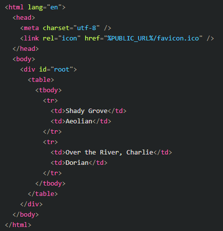

#  Proceso de captura y propagación (bubbling) de los eventos en Javascript.

## ¿Qué es Proceso de captura JavaScript?

    No es nada mas que una de las fases del procesamiento de eventos llamada "captura". La cual rara vez se usa en código real, (destacando que si se puede atrapar un elemento en fase de captura) ya que siempre esta presente, pero es invisible para nosotros.

    El estándar de eventos del DOM describe 3 fases de la propagación de eventos los cuales veremos mas adelante.

    Podemos explicar el proceso de captura asi:

    Al hacer clic en elemento el evento va primero a través de la cadena de ancestros hacia el elemento (fase de captura), luego ya despues se alcanza el objetivo y se desencadena ahí (fase de objetivo), y por último va hacia arriba (fase de propagación), ejecutando los manejadores en su camino.    

## ¿Qué es Event Bubbling en JavaScript?

    Es un evento de propagacion en el HTML, DOM, API cuando un evento es un elemento dentro de otro elemento, y ambos elementos han registrado un identificador para ese evento.

 
    
    Es un proceso que comienza con el elemento que desencadenó el evento y luego burbujea (asciende) hacia el contenedor de elementos en la geraquia.

    En el bubble event, el evento primero es capturado y  manejado por el elemento mas interno y luego se propaga a los elementos mas internos. (imagen de ejemplo2)

###    Ejemplo

    Supongamos que hicimos clic en un elemento <td> en una <table>

    Nuestro Event Bubbling sucederia de la siguiente manera:

### Orden de activación de propagación de eventos
    Podria decirse que hay tres fases por las que pasa la propagación de eventos.

    1. Fase de captura: Se activa un evento. Este evento "captura" o se propaga primero a través del evento padre, que es el objeto de window, luego el document, luego el html y luego los demás elementos internos. Baja hasta que llega al event.target (en lo que hiciste clic / el evento desencadenado).
    
    2. Fase objetiva: Llegamos al event.target. Por ejemplo, cuando un usuario hace clic en un botón, este es el elemento actual de botón.
    
    3. Fase de propagación: Este evento comienza desde event.target y se propaga hasta que llega al elemento padre superior nuevamente (aunque el evento del elemento padre no se vuelve a llamar).

### ¿Por qué existe la propagación de eventos?

    Una de las intenciones de JavaScript con la creación del patrón de propagación de eventos era facilitar la captura de eventos de una fuente, el elemento padre, en lugar de configurar un controlador de eventos en cada elemento secundario interno.

### Conclusiones

    De manera simple, el Event Bubbling es un evento de propagacion del JS el cual, al hacer clic en un elemento con un target, se provocará una reacción en cadena con los demas elementos padres que esten por encima de nuestro elemento selecionado. Dando por resultado, que estos elementos padres se vean afectados por el evento principal que desencadeno nuestro elemento al que hicicmos clic.

    Mientras que la captura, es simplemente el recorrido que se hacer para llegar nuestro elemento target, parecido bubujeo solo que al réves.

